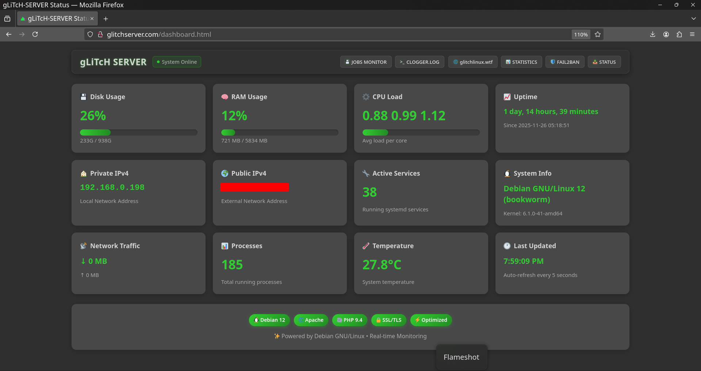
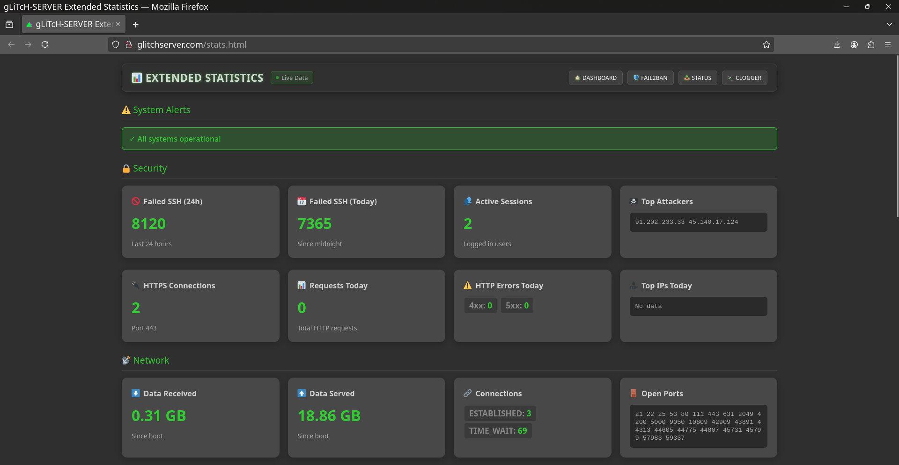
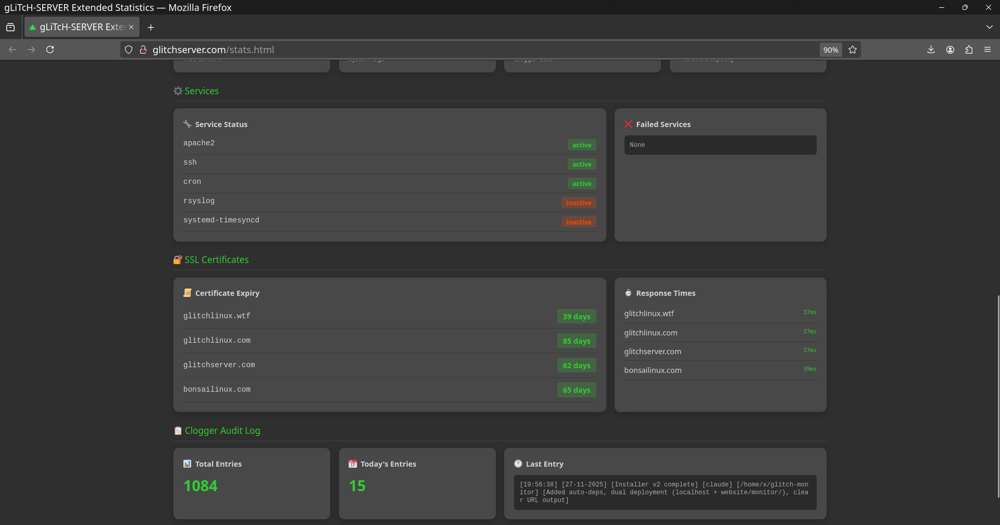
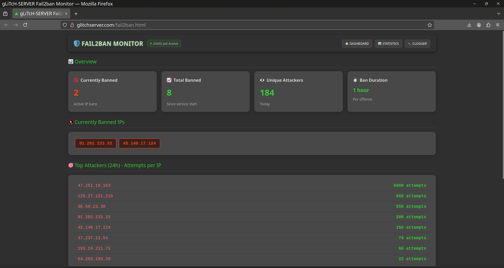

# 🖥️ gLiTcH-Monitor

A lightweight, modern server monitoring dashboard for Linux systems. Built with pure HTML, CSS, and PHP — no frameworks, no bloat, no bullshit.



## Features

- **Real-time monitoring** — Auto-refresh every 5-10 seconds
- **Zero dependencies** — Just Apache/Nginx + PHP
- **Lightweight** — Under 100KB total
- **Modern dark theme** — Easy on the eyes, looks professional
- **Mobile responsive** — Monitor from anywhere
- **Fail2ban integration** — See banned IPs and attackers in real-time
- **SSL certificate tracking** — Never miss an expiry
- **Status export** — Download comprehensive .txt reports

## Pages

| Page | Description |
|------|-------------|
| `dashboard.html` | System overview — CPU, RAM, disk, network, uptime |
| `stats.html` | Extended stats — Security, Apache, storage, services, SSL certs |
| `fail2ban.html` | Security monitor — Banned IPs, top attackers, jail config |
| `status-download.php` | Export full server status as timestamped .txt |

## Quick Install

```bash
git clone https://github.com/glitchlinux/glitch-monitor.git
cd glitch-monitor
sudo python3 installer.py
```

The installer will:
- Auto-detect your distro (Debian/Ubuntu, RHEL/Fedora, Arch)
- Install missing dependencies (Apache, PHP, fail2ban)
- Ask for your custom server name
- Optionally deploy to an existing website as `/monitor/`
- Configure everything automatically

## Requirements

- Linux (Debian/Ubuntu, RHEL/Fedora, Arch)
- Apache2 or Nginx + PHP 7.4+
- Optional: fail2ban (for security monitoring)

## Security

By default binds to **localhost:8443 only**. For remote access:
- Use SSH tunnel: `ssh -L 8443:localhost:8443 user@server`
- Or deploy to existing website with HTTPS

## Screenshots

### Dashboard


### Extended Statistics



### Fail2ban Monitor


## Comparison

| Tool | RAM | Install Size | UI |
|------|-----|--------------|-----|
| Cockpit | ~100MB | 200MB+ | Heavy |
| Webmin | ~80MB | 150MB+ | Dated |
| Netdata | ~150MB | 300MB+ | Overkill |
| **gLiTcH-Monitor** | **~5MB** | **<100KB** | **Modern** |

## License

MIT License — do whatever you want with it.

## Credits

Built by [GLITCH LINUX](https://glitchlinux.com) 

##
